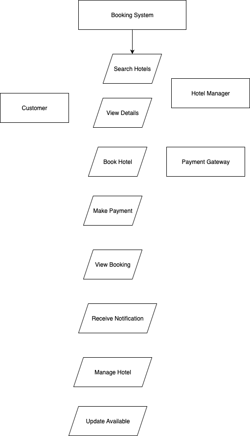

# Requirement Analysis in Software Development

Welcome to the **Requirement Analysis Project** repository.

## 📌 About This Repository

This repository is created as part of a hands-on learning project focused on mastering **Requirement Analysis** within the **Software Development Lifecycle (SDLC)**. The purpose of this project is to document and analyze the foundational requirements needed to design and develop a **Booking Management System**, using real-world standards and practices.

Throughout this repository, you will find detailed documentation covering:

- Functional and non-functional requirements
- Use case diagrams and system actor interactions
- Visual representations using Draw.io
- Acceptance criteria aligned with business goals
- Structured markdown documentation for clarity and collaboration

The goal is to simulate a real-world requirement analysis phase, enabling the development of scalable and user-centered systems by laying the proper groundwork.

---

## 📖 What is Requirement Analysis?

**Requirement Analysis** is a crucial phase in the Software Development Lifecycle (SDLC) that involves gathering, analyzing, validating, and documenting the needs and expectations of stakeholders for a proposed software system. It acts as the foundation for designing, developing, and deploying a successful application.

During this phase, developers, analysts, and stakeholders collaborate to identify **what the system should do (functional requirements)** and **how well it should perform (non-functional requirements)**. The process ensures a shared understanding of the system goals, features, constraints, and user expectations before any code is written.

### 🔍 Why is Requirement Analysis Important?

- **Clarifies Project Scope**  
  It defines the boundaries and expectations of the project, reducing ambiguity and misunderstandings.

- **Improves Communication**  
  It serves as a communication bridge between technical teams and stakeholders, ensuring all parties are aligned.

- **Reduces Cost and Rework**  
  Identifying and addressing requirements early minimizes errors, reducing the need for costly changes later in development.

- **Guides Design and Development**  
  It provides a clear roadmap for developers, making the design and implementation process more efficient and structured.

- **Supports Testing and Validation**  
  Well-defined requirements help testers build relevant test cases to validate that the software meets the intended purpose.

### 📋 Activities Involved in Requirement Analysis

- Requirement Gathering through interviews, surveys, and observation
- Identifying functional and non-functional requirements
- Defining use cases and user stories
- Creating visual models such as use case diagrams and data flow diagrams
- Validating and verifying requirements with stakeholders

In summary, Requirement Analysis ensures that software development begins with a deep understanding of user needs and business goals, setting the stage for delivering valuable, usable, and reliable solutions.

---

## ⭐ Why is Requirement Analysis Important?

Requirement Analysis is a foundational step in the Software Development Lifecycle (SDLC) that significantly influences the success of any software project. Here are three key reasons why it is critical:

### 1. Prevents Misunderstandings and Scope Creep  
By clearly defining what the software should and should not do, requirement analysis ensures all stakeholders have a shared understanding. This reduces the chances of miscommunication and helps prevent scope creep, which can lead to delays and budget overruns.

### 2. Improves Design and Development Efficiency  
Well-documented requirements act as a blueprint for the design and development phases. Developers can write better-structured code and architects can create more effective system designs when they have a clear set of expectations to follow.

### 3. Enables Better Testing and Validation  
Requirements provide a solid basis for creating test cases. When requirements are specific and measurable, it becomes easier to verify if the final product meets the intended goals, which helps improve quality and reliability.

In summary, requirement analysis helps align the development process with business objectives, minimizes risks, and increases the likelihood of delivering a successful product.

---

## 🛠️ Key Activities in Requirement Analysis

Requirement Analysis involves several structured activities that help ensure the success of a software project. Below are the five key activities typically performed during this phase:

- **Requirement Gathering**  
  This involves collecting information from stakeholders such as clients, users, and domain experts to understand what they expect from the system. Techniques include interviews, questionnaires, observation, and reviewing existing documentation.

- **Requirement Elicitation**  
  Elicitation goes beyond just gathering data—it focuses on uncovering the real needs of users, which may not be explicitly stated. This step uses strategies like brainstorming, workshops, role-playing, and use case scenarios to identify both functional and non-functional needs.

- **Requirement Documentation**  
  All collected and elicited requirements are clearly documented in a structured format. This can include Software Requirement Specifications (SRS), user stories, use case diagrams, and flowcharts. The goal is to ensure all stakeholders can review and understand the requirements.

- **Requirement Analysis and Modeling**  
  At this stage, the requirements are examined for clarity, completeness, feasibility, and consistency. Modeling tools such as data flow diagrams, entity-relationship diagrams, and use case diagrams are often used to visualize system behavior and interactions.

- **Requirement Validation**  
  The final step is to confirm that the documented requirements accurately reflect stakeholder needs. Validation involves reviews, walkthroughs, and approval sessions with clients or end users to ensure everything is correct before moving on to design and development.

These activities form the backbone of a successful software project by ensuring that the development team builds the right system for the right purpose.

--

## 📂 Types of Requirements

In software development, requirements are generally classified into two categories: **Functional Requirements** and **Non-functional Requirements**. Both are essential for building robust and scalable systems. Below is an explanation of each, along with relevant examples derived from the booking management system case study.

### ✅ Functional Requirements

Functional requirements define the specific behavior or functions of the system — what the system should do. These are derived from user needs and directly relate to the business logic of the application.

**Examples from the Booking Management System:**

- **User Authentication:** Users (both hotel managers and customers) must be able to register, log in, and manage their accounts.
- **Hotel Management Portal:** Hotel managers should be able to add, update, or delete hotel listings and manage availability through a dedicated service.
- **Hotel Search and Booking:** Customers must be able to search for available hotels using filters (location, date, price) and book rooms.
- **Payment Integration:** Customers must be able to complete payments securely via integrated third-party services.
- **View Booking History:** Users must be able to view current and past bookings in their profiles.
- **Notification System:** When a booking is made, both the customer and hotel manager should receive real-time notifications.

### ⚙️ Non-functional Requirements

Non-functional requirements define **how** the system performs a function. They include performance, security, scalability, and other quality attributes.

**Examples from the Booking Management System:**

- **Scalability:** The system must handle a high volume of traffic, especially during peak seasons, using microservices and load balancing.
- **Performance:** APIs should have fast response times, achieved through Redis caching and ElasticSearch for quick reads.
- **Reliability:** Use of master-slave database architecture ensures high availability and fault tolerance for hotel data.
- **Data Archiving:** Old bookings and transactional data should be archived using Cassandra to maintain system performance.
- **Security:** Secure access for different users (customers, managers) and encrypted payment processing.
- **Availability:** The use of CDNs ensures quick content delivery across geographic regions to improve user experience.

Both types of requirements are essential. Functional requirements ensure the system works as expected, while non-functional requirements ensure it works well, reliably, and at scale.

---

## 🧩 Use Case Diagrams

**Use Case Diagrams** are a visual tool used in requirement analysis to capture and communicate the functional requirements of a system. They show how different users (called actors) interact with the system through various actions or use cases.

### 🔍 Benefits of Use Case Diagrams

- **Clarity**: They provide a clear overview of system functionality from the user's perspective.
- **Communication**: Help bridge the understanding between technical and non-technical stakeholders.
- **Requirement Validation**: Make it easier to identify missing or unnecessary functionality.
- **Design Foundation**: Serve as a base for identifying classes, interfaces, and test cases in later stages.

### 🎯 Use Case Diagram: Booking Management System

Below is a simplified use case diagram for the booking system. It highlights key actors such as the **Customer** and **Hotel Manager**, and their main interactions with the system.

**Actors**:
- Customer
- Hotel Manager
- Payment Gateway (external system)
- Admin

**Key Use Cases**:
- Register/Login
- Search Hotels
- View Hotel Details
- Book Hotel
- Make Payment
- View Booking History
- Manage Hotel Listing
- Update Availability
- Receive Notifications

This diagram was created using Draw.io and exported as a PNG file named `alx-booking-uc.png`.
